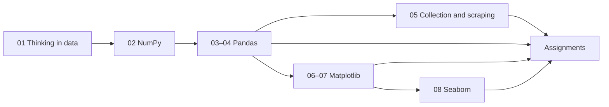

# Data Analysis with Python

Hands-on Jupyter curriculum for learning the core Python data analysis stack: NumPy, Pandas, HTTP/API data collection, BeautifulSoup scraping, Matplotlib, and Seaborn.

This repository is a personal learning and practice workspace — tutorial notebooks, PDF notes, assignments (with solutions where completed), and sample datasets used throughout the modules.

## What you will learn

- Clean and reason about messy real-world records with plain Python before introducing libraries
- Use NumPy for arrays, vectorization, broadcasting, and basic numerical operations
- Work with Pandas Series/DataFrames: I/O (CSV/JSON), filtering, missing values, feature engineering, group/agg, reshape, and joins
- Collect data from public HTTP APIs and scrape HTML pages with `requests` and BeautifulSoup
- Build charts with Matplotlib (line, bar, scatter, pie, hist, box, stack, subplots)
- Create statistical plots with Seaborn (relational, categorical, distribution, and heatmap views)

## Tech stack

| Area | Libraries |
| --- | --- |
| Numerical computing | NumPy |
| Tabular data | Pandas |
| HTTP & scraping | requests, BeautifulSoup4 (`bs4`), lxml |
| Visualization | Matplotlib, Seaborn |
| Runtime | Python 3, Jupyter Notebook / JupyterLab |

No application server, database, authentication layer, or packaged library is included. Notebooks are the primary interface.

## Repository structure

```text
.
├── notebooks/          # Numbered tutorial notebooks (main learning path)
├── assignments/        # Practice questions, PDFs, and solutions
├── notes/              # PDF reference notes for major modules
└── data/               # Datasets used by notebooks and assignments
    ├── cleaned-data/   # Processed CSV outputs from scraping/cleaning
    └── scraped-data/   # Saved HTML pages for offline parsing practice
```

### Notebooks (recommended order)

| # | Notebook | Focus |
| --- | --- | --- |
| 01 | [`01_thinking_data.ipynb`](notebooks/01_thinking_data.ipynb) | Load messy JSON, clean ratings/duplicates/missing values, derive simple insights and rule-based recommendations |
| 02 | [`02_numpy_tutorial.ipynb`](notebooks/02_numpy_tutorial.ipynb) | Arrays vs lists, creation helpers, indexing/slicing, copy vs view, multi-D arrays, vectorization, broadcasting, math helpers |
| 03 | [`03_pandas_tutorial_part_1.ipynb`](notebooks/03_pandas_tutorial_part_1.ipynb) | Series/DataFrames, CSV/JSON loading, exploration helpers, indexing/selection (uses employee and air-quality data) |
| 04 | [`04_pandas_tutorial_part_2.ipynb`](notebooks/04_pandas_tutorial_part_2.ipynb) | Feature engineering, grouping, melt/pivot, basic plots, merge/join, concatenation |
| 05 | [`05_data_collection.ipynb`](notebooks/05_data_collection.ipynb) | `requests` against a public books API; scrape country data from HTML and persist results |
| 06 | [`06_matplotlib_tutorial_part_1.ipynb`](notebooks/06_matplotlib_tutorial_part_1.ipynb) | Line, bar (incl. grouped/horizontal), scatter, pie charts and styling |
| 07 | [`07_matplotlib_tutorial_part_2.ipynb`](notebooks/07_matplotlib_tutorial_part_2.ipynb) | Histograms, box plots, stack plots, and subplot layouts (`plt.subplot` / `fig, ax`) |
| 08 | [`08_seaborn_tutorial.ipynb`](notebooks/08_seaborn_tutorial.ipynb) | Themes; `relplot`/`scatterplot`/`lineplot`; bar/box; hist; heatmaps using built-in Seaborn datasets |

### Assignments

| File | Type |
| --- | --- |
| [`01_pandas_assignment.pdf`](assignments/01_pandas_assignment.pdf) | Pandas practice brief |
| [`02_pandas_assignment_solution.ipynb`](assignments/02_pandas_assignment_solution.ipynb) | Solution using Iris and Titanic CSVs |
| [`03_data_collection_practice_question.ipynb`](assignments/03_data_collection_practice_question.ipynb) | Fetch Pokemon details from PokéAPI |
| [`04_web_scraping_practice_question.ipynb`](assignments/04_web_scraping_practice_question.ipynb) | Scrape quotes.toscrape.com (or parse saved HTML) into CSV |
| [`05_matplotlib_practice_question.ipynb`](assignments/05_matplotlib_practice_question.ipynb) | Multi-city rainfall subplots |
| [`06_data_visualization_assignment.pdf`](assignments/06_data_visualization_assignment.pdf) | Visualization assignment brief |
| [`07_data_visualization_assignment_solution.ipynb`](assignments/07_data_visualization_assignment_solution.ipynb) | Matplotlib + Seaborn solutions |

### Notes

PDF quick references live under [`notes/`](notes/): NumPy, Pandas, Matplotlib, and Seaborn.

## How the materials fit together



1. Start with plain-Python cleaning to establish a data workflow mindset.
2. Move to NumPy, then Pandas for tabular analysis.
3. Add collection/scraping, then visualization (Matplotlib → Seaborn).
4. Reinforce each stage with the matching assignment and PDF notes.

Notebooks use relative paths such as `../data/...`. Launch Jupyter from the repository root so those paths resolve.

## Datasets

| Path | Role |
| --- | --- |
| `data/store_data.json` | Messy product feedback for the thinking-data notebook |
| `data/raw_data.csv` | Duplicate/missing fields for Pandas cleaning and feature engineering |
| `data/employee_data.csv` / `employee_data.json` | Small employee table for I/O and joins |
| `data/global_air_quality.csv` | Larger tabular sample for Pandas exploration |
| `data/iris.csv` | Classic classification features (assignment) |
| `data/titanic_dataset.csv` | Survival/demographic EDA practice (assignment) |
| `data/scraped-data/*.html` | Cached HTML from scraping exercises |
| `data/cleaned-data/*.csv` | Example outputs from scraping/cleaning workflows |

External services used in live collection notebooks (network required when re-running fetches):

- Stephen King books API (`stephen-king-api.onrender.com`)
- [Scrape This Site](https://www.scrapethissite.com/pages/simple/) country pages
- [Quotes to Scrape](https://quotes.toscrape.com/)
- [PokéAPI](https://pokeapi.co/)

Saved HTML under `data/scraped-data/` allows offline parsing practice without re-hitting the web.

## Prerequisites

- Python 3.x
- Ability to create a virtual environment and install packages with `pip`
- Jupyter Notebook or JupyterLab
- Internet access for API/scraping cells (optional if you only run offline parsing / local CSV work)

## Installation and setup

```bash
git clone https://github.com/raghhavv03/data-analysis-with-python.git
cd data-analysis-with-python

python3 -m venv .venv
source .venv/bin/activate   # Windows: .venv\Scripts\activate

pip install jupyter pandas numpy matplotlib seaborn beautifulsoup4 requests lxml
```

There is currently no pinned `requirements.txt` in the repository; the install line above matches the libraries imported by the notebooks.

## Running the notebooks

From the repository root:

```bash
jupyter notebook
# or
jupyter lab
```

Open files under `notebooks/` in order (`01` → `08`). Run assignment notebooks from `assignments/` after the related tutorial.

## Usage tips

- Prefer executing cells top-to-bottom; later cells often depend on earlier state.
- For scraping/API notebooks, expect failures if the remote site is down; use the saved HTML/CSV artifacts when available.
- Seaborn tutorials load built-in sample datasets (`tips`, `flights`, `penguins`) via `sns.load_dataset`, which may require a network fetch the first time.

## Limitations

- This is coursework/practice material, not a production analysis pipeline or reusable package.
- Notebooks are primarily code-driven with brief inline comments; there is little narrative Markdown inside cells.
- Dependency versions are not pinned; package APIs may differ slightly across environments.
- No automated tests, CI, or deployment configuration.
- No license file is present in the repository.

## Contributing

This repository documents personal learning progress. If you fork it for your own study, keep notebook path conventions (`../data/...`) and the numbered module order so local datasets continue to resolve.
